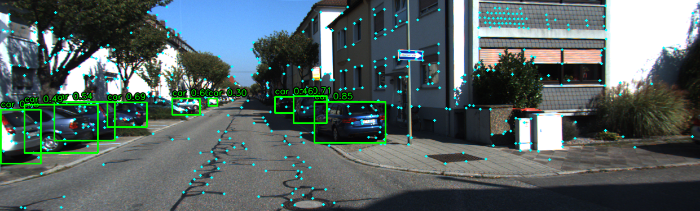
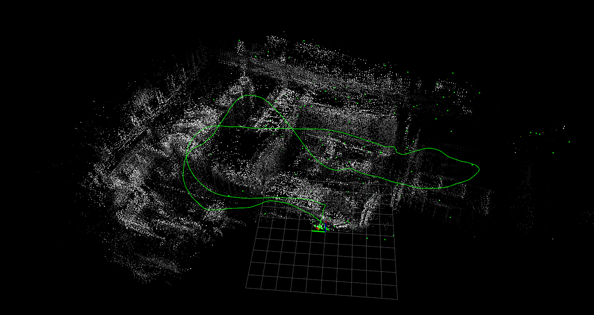
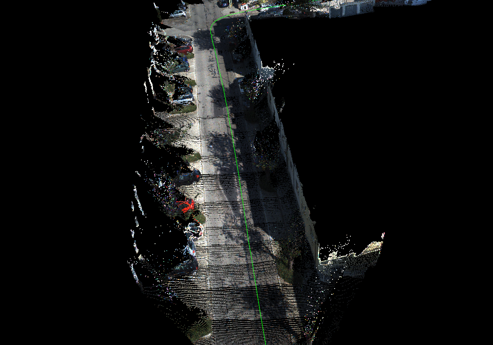
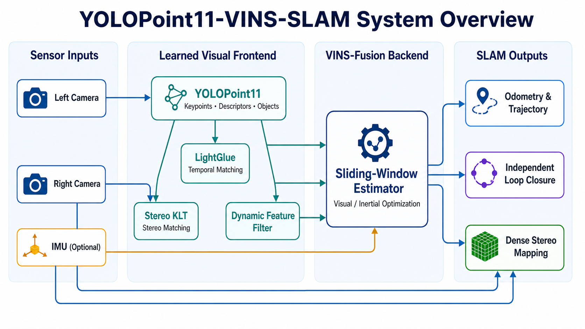

# YOLOPoint11-VINS-SLAM

YOLOPoint11-VINS-SLAM is a learning-enhanced stereo visual and visual-inertial
SLAM system for ROS 2. Built on the optimization backend of
[VINS-Fusion](https://github.com/HKUST-Aerial-Robotics/VINS-Fusion), it replaces
the conventional temporal feature frontend with YOLOPoint11 keypoints and
[LightGlue](https://github.com/cvg/LightGlue) matching, while retaining stereo
geometry and tightly coupled IMU optimization. The system supports only
**stereo** and **stereo + IMU** operation.

In addition to camera motion estimation, this project connects joint keypoint
and object perception, dynamic-feature rejection, loop closure, and dense
stereo mapping in one deployable pipeline. The neural models run through ONNX
Runtime with CPU, CUDA, or TensorRT execution providers.

The YOLOPoint11 frontend in this repository is modified and extended from the
original [UniBwTAS/YOLOPoint](https://github.com/UniBwTAS/YOLOPoint) codebase
for integration with stereo VINS-Fusion, LightGlue, ROS 2, and ONNX Runtime.

<p align="center">
  
  <br>
  <em>YOLOPoint11 joint feature and vehicle detection on KITTI.</em>
</p>

<table>
  <tr>
    <td align="center" width="50%">
      <br>
      <em>EuRoC trajectory and dense reconstruction.</em>
    </td>
    <td align="center" width="50%">
      <br>
      <em>KITTI trajectory and colored dense reconstruction.</em>
    </td>
  </tr>
</table>

The repository distributes portable ONNX models only. It does **not** bind the
build to the author's filesystem, GPU model, CUDA architecture, Conda
environment, or pre-generated TensorRT engines.

## Contents

- [Features](#features)
- [System overview](#system-overview)
- [Tested environment](#tested-environment)
- [Requirements](#requirements)
- [Clone the repository](#clone-the-repository)
- [Install dependencies](#install-dependencies)
- [Install ONNX Runtime](#install-onnx-runtime)
- [Build](#build)
- [Generate TensorRT artifacts](#generate-tensorrt-artifacts-optional)
- [Run on EuRoC](#run-on-euroc)
- [Run on KITTI odometry](#run-on-kitti-odometry)
- [Visualize with RViz](#visualize-with-rviz)
- [Configuration](#configuration)
- [Troubleshooting](#troubleshooting)
- [Repository layout](#repository-layout)
- [License and acknowledgements](#license-and-acknowledgements)

## Features

- **Stereo and stereo-inertial estimation:** VINS-Fusion sliding-window
  optimization, IMU preintegration, marginalization, and online calibration.
- **Learned visual frontend:** YOLOPoint11 extracts repeatable keypoints and
  128-dimensional descriptors; LightGlue performs temporal matching between
  consecutive left-camera frames.
- **Stereo geometry:** bidirectional pyramidal KLT matching and geometric
  filtering provide right-camera observations and metric depth constraints.
- **Joint object perception:** the full YOLOPoint11 model produces COCO object
  detections together with local features in a single inference pass.
- **Dynamic-feature filtering:** features inside potentially dynamic object
  regions can be rejected before entering the estimator.
- **ORB or YOLOPoint loop closure:** the independent loop backend supports a
  self-contained ORB mode and a YOLOPoint + LightGlue mode, followed by stereo
  geometric verification and pose-graph drift correction.
- **Dense mapping:** Fast-FoundationStereo supports online keyframe point-cloud
  fusion; a dedicated offline stereo mapping tool is also included.
- **Portable acceleration:** ONNX Runtime CPU, CUDA, and TensorRT backends,
  optional CUDA postprocessing, and deployment-machine TensorRT cache creation.
- **ROS 2 integration:** launch files, RViz configurations, and examples for
  EuRoC stereo + IMU and KITTI stereo odometry.

## System overview

The project combines a modified version of the
[UniBwTAS/YOLOPoint](https://github.com/UniBwTAS/YOLOPoint) learned frontend
([paper](https://arxiv.org/abs/2402.03989)) with the nonlinear estimation
framework of VINS-Fusion. Our implementation extends that combination into a
complete ROS 2 stereo SLAM pipeline:

<p align="center">
  
</p>

The processing sequence is:

1. YOLOPoint11 jointly predicts local features and optional object detections
   from the current left image.
2. LightGlue associates left-image features over time, while stereo KLT
   associates features between the synchronized left and right images.
3. Object detections provide a semantic prior for removing features on
   potentially dynamic objects.
4. VINS-Fusion fuses the visual constraints with optional IMU measurements in
   a tightly coupled sliding-window optimization.
5. Loop closure and dense stereo mapping consume estimator keyframes to produce
   drift correction, trajectory visualization, and dense point clouds.

### Loop-closure modes

The independent loop-closure backend supports two selectable visual modes:

| `loop_closure_mode` | Visual frontend | Description |
|---:|---|---|
| `1` | ORB | Detects and describes ORB features inside the loop backend. |
| `3` | YOLOPoint + LightGlue | Reuses YOLOPoint features from frontend type `3` and uses learned feature matching. |

Both modes apply appearance candidate retrieval, stereo geometric verification,
relative-pose validation, and pose-graph optimization. YOLOPoint loop closure
requires `feature_tracker_type: 3`; ORB loop closure remains available when the
traditional LK tracking frontend is selected.

## Tested environment

| Component | Tested version |
|---|---|
| Operating system | Ubuntu 22.04 LTS |
| ROS | ROS 2 Humble |
| Compiler | GCC 10/11 |
| CMake | 3.22 |
| OpenCV | 4.5.4 |
| Eigen | 3.4 |
| Ceres Solver | 2.0 |
| ONNX Runtime | GPU 1.22.0 |
| CUDA | Optional, CUDA 12.x recommended for ORT 1.22 GPU |
| TensorRT | Optional, TensorRT 10 tested |

ONNX Runtime 1.22.0 is the verified version, not a restriction to one NVIDIA
GPU family. CPU-only machines can use a CPU ONNX Runtime SDK. NVIDIA GPU users
should use mutually compatible driver, CUDA, cuDNN, ONNX Runtime, and TensorRT
versions. Runtime performance depends on the selected provider and hardware.

## Requirements

Required:

- Linux x86-64 (Ubuntu 22.04 is the tested platform)
- ROS 2 Humble and `colcon`
- CMake and a C++14 compiler
- OpenCV, Eigen3, Boost, and Ceres Solver
- ONNX Runtime C/C++ SDK containing:
  - `include/onnxruntime_cxx_api.h`
  - `lib/libonnxruntime.so` or `lib64/libonnxruntime.so`
- The ONNX files included under `onxx/`

Optional:

- NVIDIA CUDA Toolkit for CUDA keypoint postprocessing and CUDA inference
- cuDNN required by the selected ONNX Runtime GPU package
- TensorRT for TensorRT execution and locally generated engines/caches
- Python 3 packages in `models_tools/requirements-runtime.txt` for model
  validation and TensorRT artifact generation
- `evo` for trajectory evaluation

## Clone the repository

Clone the project into a ROS 2 workspace.

```bash
mkdir -p ~/yolopoint_ws/src
cd ~/yolopoint_ws/src
git clone https://github.com/hyulin472-dotcom/yolopoint11-vins-slam.git
cd yolopoint11-vins-slam
```

If Git LFS is used to publish the ONNX files, install Git LFS before cloning
and confirm that the model files are real binaries rather than pointer files:

```bash
git lfs install
git lfs pull
find onxx -name '*.onnx' -type f -ls
```

All following commands assume that the current directory is the repository
root unless stated otherwise.

## Install dependencies

Install common build tools and native libraries:

```bash
sudo apt update
sudo apt install -y \
  build-essential cmake git python3-pip \
  libboost-all-dev libceres-dev libeigen3-dev libopencv-dev
```

Install ROS 2 Humble using the official ROS instructions if it is not already
installed. Then let `rosdep` install the ROS package dependencies:

```bash
source /opt/ros/humble/setup.bash
sudo rosdep init  # run once per computer; skip if already initialized
rosdep update
rosdep install --from-paths . --ignore-src -r -y --rosdistro humble
```

## Install ONNX Runtime

ONNX Runtime is required. Download or install a C/C++ SDK that matches the
target operating system and desired execution provider.

Typical extracted SDK layout:

```text
onnxruntime-linux-x64-1.22.0/
├── include/
│   └── onnxruntime_cxx_api.h
└── lib/
    └── libonnxruntime.so
```

The build system searches normal system paths automatically. If the SDK is in
a custom directory, export its root:

```bash
export ONNXRUNTIME_ROOT=/absolute/path/to/onnxruntime-linux-x64-1.22.0
```

For ONNX Runtime GPU 1.22.0, use a compatible CUDA 12.x and cuDNN 9.x runtime.
The CPU SDK does not require an NVIDIA GPU, CUDA, cuDNN, or TensorRT.

## Build

Return to the repository root and source ROS:

```bash
cd ~/yolopoint_ws/src/yolopoint11-vins-slam
source /opt/ros/humble/setup.bash
```

### Automatic ONNX Runtime discovery

Use this when ONNX Runtime is installed in a standard system location:

```bash
colcon build --symlink-install --cmake-args -DCMAKE_BUILD_TYPE=Release
source install/setup.bash
```

### Manual ONNX Runtime location

Use this for an extracted SDK in a custom directory:

```bash
export ONNXRUNTIME_ROOT=/absolute/path/to/onnxruntime-linux-x64-gpu-1.22.0

colcon build --symlink-install --cmake-args \
  -DCMAKE_BUILD_TYPE=Release \
  -DONNXRUNTIME_ROOT="$ONNXRUNTIME_ROOT"

source install/setup.bash
```

When NVCC is available, optional CUDA postprocessing is enabled automatically.
No CUDA architecture is hardcoded by the repository.

### CPU build or build without NVCC

Disable the optional CUDA source explicitly:

```bash
colcon build --symlink-install --cmake-args \
  -DCMAKE_BUILD_TYPE=Release \
  -DONNXRUNTIME_ROOT="$ONNXRUNTIME_ROOT" \
  -DVINS_ENABLE_CUDA=OFF

source install/setup.bash
```

This option controls compilation of the CUDA keypoint postprocessor. The
available neural-network execution providers still depend on the supplied
ONNX Runtime SDK and the YAML runtime configuration.

### Specify a CUDA architecture manually

This is normally unnecessary. It is useful for cross-compilation or controlled
deployment builds:

```bash
colcon build --symlink-install --cmake-args \
  -DCMAKE_BUILD_TYPE=Release \
  -DONNXRUNTIME_ROOT="$ONNXRUNTIME_ROOT" \
  -DVINS_CUDA_ARCHITECTURES=86
```

Replace `86` with the target CUDA compute capability. Do not reuse this value
blindly on a different target GPU.

### Runtime library path

Installed executables intentionally do not embed the build computer's absolute
ONNX Runtime path. If `libonnxruntime.so` is outside the system library paths,
expose it before running:

```bash
export ONNXRUNTIME_ROOT=/absolute/path/to/onnxruntime-linux-x64-gpu-1.22.0
export LD_LIBRARY_PATH="$ONNXRUNTIME_ROOT/lib:${LD_LIBRARY_PATH:-}"
source install/setup.bash
```

If the SDK uses `lib64`, replace `$ONNXRUNTIME_ROOT/lib` with
`$ONNXRUNTIME_ROOT/lib64`.

## Generate TensorRT artifacts (optional)

Skip this section when using the CPU or CUDA execution provider. TensorRT
engines and ONNX Runtime TensorRT caches are hardware/software-specific and
must be generated on the computer that will run SLAM.

Install the Python conversion dependencies in an environment that provides
TensorRT and ONNX Runtime with `TensorrtExecutionProvider`:

```bash
python3 -m pip install -r models_tools/requirements-runtime.txt
./tools/build_tensorrt_engines.sh --force
```

If TensorRT and ONNX Runtime are installed in separate Python environments:

```bash
TENSORRT_PYTHON=/path/to/tensorrt/python \
ONNXRUNTIME_PYTHON=/path/to/onnxruntime-gpu/python \
./tools/build_tensorrt_engines.sh --force
```

Generated files are written below `onxx/*/trt_cache/`. They are ignored by
Git. Regenerate them after changing any of the following:

- GPU model or compute capability
- NVIDIA driver, CUDA, cuDNN, TensorRT, or ONNX Runtime version
- ONNX model, precision, input resolution, or optimization profile

The LightGlue graph uses the ONNX Runtime TensorRT cache because its dynamic
operations are not supported by every standalone TensorRT parser version.

## Run on EuRoC

Download the EuRoC Machine Hall 01 ROS bag and note its path. In every terminal,
source ROS, the workspace, and (when necessary) the ONNX Runtime library path:

```bash
cd ~/yolopoint_ws/src/yolopoint11-vins-slam
source /opt/ros/humble/setup.bash
source install/setup.bash
export LD_LIBRARY_PATH="$ONNXRUNTIME_ROOT/lib:${LD_LIBRARY_PATH:-}"
```

Terminal 1 — start the estimator:

```bash
ros2 launch vins euroc.launch.py \
  config_path:="$(pwd)/config/euroc/euroc_stereo_imu_config.yaml"
```

Terminal 2 — play the EuRoC ROS 2 bag:

```bash
ros2 bag play /absolute/path/to/MH_01_easy
```

If the downloaded dataset is a ROS 1 `.bag`, convert it to ROS 2 first or use a
compatible ROS 1-to-ROS 2 bag workflow. The configuration expects these topics:

```text
/imu0
/cam0/image_raw
/cam1/image_raw
```

The default result is written to:

```text
output/euroc_MH_01/vio.csv
```

## Run on KITTI odometry

Download KITTI odometry sequence 00 and arrange the sequence directory as:

```text
/absolute/path/to/kitti/dataset/sequences/00/
├── image_0/
├── image_1/
└── times.txt
```

Run the dedicated KITTI executable from the repository root:

```bash
cd ~/yolopoint_ws/src/yolopoint11-vins-slam
source /opt/ros/humble/setup.bash
source install/setup.bash
export LD_LIBRARY_PATH="$ONNXRUNTIME_ROOT/lib:${LD_LIBRARY_PATH:-}"

ros2 run vins kitti_odom_test \
  "$(pwd)/config/kitti_odom/kitti_config00-02.yaml" \
  /absolute/path/to/kitti/dataset/sequences/00
```

The output trajectories are written to:

```text
output/kitti_odom_00/vio.csv
output/kitti_odom_00/vio.txt
```

`vio.txt` uses the KITTI 3x4 pose-matrix format. Use the other configuration
files under `config/kitti_odom/` for their corresponding sequences.

## Visualize with RViz

Start RViz in another sourced terminal:

```bash
ros2 launch vins vins_rviz.launch.py
```

Useful topics include:

```text
/vins_estimator/path
/vins_estimator/odometry
/vins_estimator/point_cloud
/vins_estimator/image_track
/vins_estimator/camera_pose
```

## Configuration

Main example configurations:

| File | Purpose |
|---|---|
| `config/euroc/euroc_stereo_imu_config.yaml` | EuRoC stereo + IMU |
| `config/euroc/euroc_stereo_config.yaml` | EuRoC stereo only |
| `config/kitti_odom/kitti_config00-02.yaml` | KITTI sequences 00–02 |
| `config/kitti_odom/kitti_config03.yaml` | KITTI sequence 03 |
| `config/kitti_odom/kitti_config04-12.yaml` | KITTI sequences 04–12 |
| `config/kitti_odom/kitti_config13-21.yaml` | KITTI sequences 13–21 |

Important frontend options:

```yaml
feature_tracker_type: 3              # 0: LK, 3: YOLOPointv11 + LightGlue
yolopoint_lightglue_backend: tensorrt # cpu, cuda, or tensorrt
yolopoint_lightglue_use_cuda: false   # optional CUDA postprocessing
```

Model paths are repository-relative and point to portable ONNX files under
`onxx/`. Output and TensorRT cache paths are also repository-relative.

To use the traditional frontend without neural feature extraction:

```yaml
feature_tracker_type: 0
```

To run without TensorRT, select a provider supported by the installed ONNX
Runtime SDK, for example:

```yaml
yolopoint_lightglue_backend: cpu
yolopoint_lightglue_use_cuda: false
```

## Troubleshooting

### ONNX Runtime was not found during CMake configuration

Expected message:

```text
ONNX Runtime C++ SDK not found. Set ONNXRUNTIME_ROOT ...
```

Check the SDK and rebuild:

```bash
test -f "$ONNXRUNTIME_ROOT/include/onnxruntime_cxx_api.h"
find "$ONNXRUNTIME_ROOT" -name 'libonnxruntime.so*'

colcon build --symlink-install --cmake-clean-cache --cmake-args \
  -DONNXRUNTIME_ROOT="$ONNXRUNTIME_ROOT"
```

### `libonnxruntime.so` cannot be opened at runtime

```bash
export LD_LIBRARY_PATH="$ONNXRUNTIME_ROOT/lib:${LD_LIBRARY_PATH:-}"
ldd install/vins/lib/vins/vins_node | grep onnxruntime
```

Use `lib64` instead of `lib` if that is where the SDK stores the library.

### CUDA compiler was not found

The project automatically builds the CPU postprocessing stub. To make the
choice explicit:

```bash
colcon build --symlink-install --cmake-args \
  -DONNXRUNTIME_ROOT="$ONNXRUNTIME_ROOT" \
  -DVINS_ENABLE_CUDA=OFF
```

### TensorRT cache fails after moving to another computer

Remove the generated cache and rebuild it on the target computer:

```bash
./tools/build_tensorrt_engines.sh --force
```

Do not distribute generated `.engine` files as portable model artifacts.

### The ROS node receives no EuRoC messages

Check topic names and ROS domain settings:

```bash
ros2 topic list
ros2 bag info /absolute/path/to/MH_01_easy
echo "${ROS_DOMAIN_ID:-0}"
```

The estimator and bag player must use the same `ROS_DOMAIN_ID`.

## Repository layout

```text
.
├── camera_models/       # camodocal camera models and calibration package
├── config/              # EuRoC, KITTI, offline dense mapping, and RViz configurations
├── models_tools/        # ONNX validation/export/TRT helper scripts
├── onxx/                # portable deployment ONNX models
├── tools/               # diagnostics, conversion, evaluation, TRT scripts
└── vins/                # ROS 2 SLAM package and launch files
```

Generated build products, trajectory output, training checkpoints, TensorRT
engines, and runtime caches are excluded by `.gitignore`.

## License and acknowledgements

Project source code is distributed under GPL-3.0-only; see [LICENCE](LICENCE).

This project is based on
[VINS-Fusion](https://github.com/HKUST-Aerial-Robotics/VINS-Fusion) and its ROS
2 ports, and uses or builds on camodocal, Ceres Solver, OpenCV, Eigen,
[UniBwTAS/YOLOPoint](https://github.com/UniBwTAS/YOLOPoint)
([paper](https://arxiv.org/abs/2402.03989)),
[LightGlue](https://github.com/cvg/LightGlue), glue-factory, ONNX Runtime, and
Fast-FoundationStereo. We thank the authors of these projects for making their
work publicly available. The YOLOPoint11 frontend distributed here contains
project-specific modifications and integration work derived from the original
YOLOPoint implementation. Preserve upstream copyright notices and verify the
redistribution terms of every ONNX model before publishing a GitHub release or
model asset.

We welcome code contributions and reproducible benchmark results. If you encounter
an issue, please provide your operating system, ROS version, ONNX Runtime provider,
GPU model, configuration file, and full error log, along with the CUDA, cuDNN, and
TensorRT versions when relevant.


